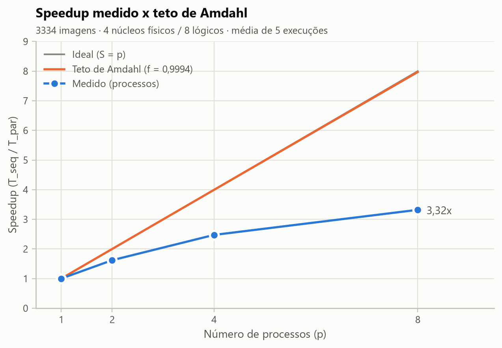

# 5. Medição e speedup

**Protocolo.** Todas as medições foram feitas na máquina da seção 4, com a mesma entrada (3.334 imagens) e o
mesmo código. A máquina ficou na tomada, em modo de alto desempenho e sem outros programas abertos. O programa
`bench.py` executou uma rodada de aquecimento, descartada, e depois 5 rodadas, cada uma com a versão sequencial
seguida das paralelas com p = 2, 4, 8 processos. Em seguida rodaram os experimentos com 8 threads e com trava
grossa em 8 processos, 3 rodadas cada. Cada execução rodou como um processo separado, com a pasta de saída
limpa antes, fora da medição. Todas as 27 execuções produziram a mesma impressão digital
(`ed067b987c6c422c`).

**Tempos, speedup e eficiência.**

| Configuração | Tempo total (s) | Speedup | Eficiência | Teto de Amdahl | Karp–Flatt |
|---|---|---|---|---|---|
| Sequencial | 252,57 ± 25,49 (n=5) | 1,00 | 100% | — | — |
| Processos, p = 2 | 155,93 ± 10,61 (n=5) | 1,62 | 81,0% | 2,00 | 0,2347 |
| Processos, p = 4 | 102,10 ± 10,68 (n=5) | 2,47 | 61,8% | 3,99 | 0,2056 |
| Processos, p = 8 | 76,07 ± 2,89 (n=5) | 3,32 | 41,5% | 7,97 | 0,2014 |
| Threads, p = 8 | 189,94 ± 1,23 (n=3) | 1,33 | 16,6% | 7,97 | 0,7166 |
| Trava grossa, p = 8 | 239,75 ± 4,28 (n=3) | 1,05 | 13,2% | 7,97 | 0,9420 |

**Teto de Amdahl.** A versão sequencial mede separadamente o preparo, o processamento e a etapa final. A fração
paralelizável estimada é f = T_processamento / T_total = 0,99944 (média de 5 execuções): as fases de preparo e
gravação final juntas somam menos de 0,2% do tempo sequencial. Com 8 processos, o teto de Amdahl é
S_max = 1 / ((1 − f) + f/8) = 7,97 e o speedup medido foi S = 3,32: 41,7% do teto.

